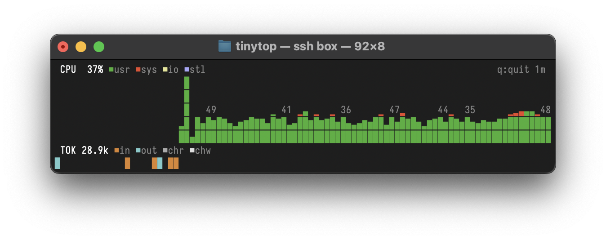

# tinytop

Tiny terminal CPU monitor with Unicode graphics. Designed for small terminals over SSH.



## Features

- **CPU**: Stacked area chart - user (green), system (red), iowait (yellow), steal (magenta)
- **Tokens**: Claude Code token usage - input (blue), output (cyan), cache read (gray), cache write (white)
- Unicode block characters for sub-character resolution
- Adapts to terminal size
- 1-second refresh rate (SSH-friendly)
- Single static binary, no dependencies

## Build

```bash
# For current platform
go build -o tinytop

# For Linux (cross-compile from macOS)
GOOS=linux GOARCH=amd64 go build -o tinytop
```

## Usage

```bash
./tinytop
```

Press `q` or `Ctrl+C` to quit.

## Claude Code Token Tracking

To see Claude Code token usage, add to your shell profile:

```bash
export CLAUDE_CODE_ENABLE_TELEMETRY=1
export OTEL_METRICS_EXPORTER=otlp
export OTEL_EXPORTER_OTLP_PROTOCOL=grpc
export OTEL_EXPORTER_OTLP_ENDPOINT=http://localhost:4317
export OTEL_METRIC_EXPORT_INTERVAL=10000  # 10 seconds
```

Then run tinytop (listens on port 4317) and use Claude Code in another terminal.

## Requirements

- Linux or macOS
- UTF-8 terminal

## Platform Notes

- **Linux**: Shows user, system, iowait, steal (reads `/proc/stat`)
- **macOS**: Shows user, system (reads `kern.cp_time` via sysctl)

## AI Notes

- `main.go` - UI and rendering
- `cpu_linux.go` - Linux `/proc/stat` parsing
- `cpu_darwin.go` - macOS Mach API
- `otel.go` - OTLP HTTP receiver for Claude Code metrics
- Uses Bubbletea for TUI, Lipgloss for styling
- Chart uses `▁▂▃▄▅▆▇█` blocks for 8-level vertical resolution
